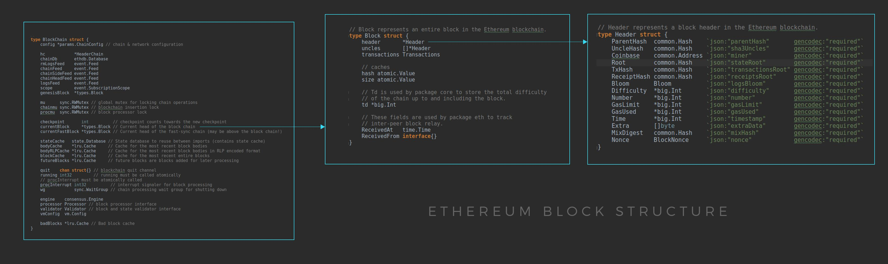

# **Introduction to blockchain Ethereum**

## **DLT: Distributed ledger technology (_= Registre Comptable Distribué_ ) AKA Blockchain**

_Note: a `distributed ledger` does not necessarily need to have a data structure in blocks. A distributed ledger is merely a type of database spread across multiple sites, regions, or participants. ... all blockchains are distributed ledgers, but not all distributed ledgers are blockchains_

Blockchain technologies solved 2 problems:

-   immutability (_= immutabilité des données_): data can't be altered
-   distributed process: no more a single point of authority or a single point of failure (`SPOF`) e.g. a bank, each nodes work together based on a consensus mechanism preventing malicious actors.

### **Immutability**

In a blockchain all transactions are stored in a block.
Each block includes the `cryptographic hash` of the prior block in the chain, linking the two blocks, and also a `cryptographic hash` of all the transactions stored in the block.  
The `cryptographic hash`, is a `hash` ( _= signature, identité des données_), a unique hexadecimal number generated by a `cryptographic hash function`.  
The `cryptographic hash function` (_= fonction de hachage_ ) is a one way function (non invertible function) that maps the content of a block to produce an output of a fixed length: a number / a hash (e.g. functions: `md5`, `shasum`). The function used to generate the hash is `deterministic`, meaning that it will produce the same result each time the same input is used. The security of the MD5 hash function was compromised when researchers were able to generate two different messages that have the same hash (`MD5 collision`).
These 2 numbers, the `cryptographic hash` of the previous block and the `cryptographic hash` of all the confirmed transactions in the block, are stored in the `block header` of the new incoming block.

-   Each block refers (_= pointe vers_) to the previous block called the `parent block`.
-   We can link blocks 235636 and 235634 only through block 235635

Bellow how this kind of process can be implemented with code:

-   `uncle blocks` inside `Block structure` are created when more than one child block is created from a parent block. This situation is possible because all the nodes that maintain the ledger are not updated instantaneously when a new block is mined. Instead, you may have two blocks mined close together, but only one gets validated across nodes on the ledger (the block height, which indicates the length of the blockchain, increases after the addition of the new block). The one that is not validated is an uncle block.
-   `Tx` = Transaction
-   `Header structure` is a JS class

Bellow a basic overview of a block header: hashes form a Merkle tree (_= arbre de Merkle_)

-   `Merkle tree` (a hash tree) = a tree in which every leaf node is labelled with the cryptographic hash of a data block, and every non-leaf node is labelled with the cryptographic hash of the labels of its child nodes. The hashes on the bottom row are referred to as `leaves`, the intermediate hashes as `branches`, and the hash at the top as the `root`. Hash trees allow efficient and secure verification of the contents of large data structures.
-   `Hash0` and `Hash1` are the hash values of data blocks (transactions) `Tx0` and `Tx1`, respectively, and `Hash01` is the hash of the concatenation of hashes 0 and 1.
-   `Prev_Hash` = Hash of the parent block
-   `Tx_Root` = Hash of all the transactions of the current block
-   `Knapsack problem` (_= probleme du sac a dos_) = given a set of items, each with a weight and a value, determine the number of each item to include in a collection so that the total weight is less than or equal to a given limit and the total value is as large as possible. It derives its name from the problem faced by someone who is constrained by a fixed-size knapsack and must fill it with the most valuable items. Miners have to choose with which transactions to fill a block in order to get the highest total value in a limited storage space on the hard drive.

This process confirms the **integrity** of the block, all the way back to the original `genesis block` by 2 means:

-   If a malicious actor wants to alter a block, for example by changing a transaction amount, he will alter the `hash` of all the transactions within the block. So he will have to mine again this block. The process will alter the whole block `hash`, and all the following blocks will have a different `hash` stored in their header for the previous block. So the malicious actor will have to mine also all the following blocks based on the `hash` of the malicious crafted block. A block is created every 15 seconds in Ethereum and 8-10 minutes in Bitcoin
-   The other protection which prevents these kind of modifications is a consensus mechanism. Attackers would need to control 51% of the network (computing power) to reverse transactions that have already taken place in a blockchain.
    This is known as the **51% Attack**. Needless to say that this is actually impossible, miners attackers would need much computational power to create and validate blocks, and even if they succeed it would invalidate trust on this blockchain and users will just leave the blockchain and choose another one.

The drawback is that this comes with responibility of the actor: in case of an error there is no possibility to get back the funds like in the case with dealing with a bank. A way to prevent this is to insure a confirmation check inside the program of the type "Are you sure that you want to ...?". There are also insurances appearing to protect against security breaches (_= failles de securite_) inside smart contracts.

### **Centralized vs Decentralized vs Distributed**

In a Distributed network there is not a single point of authority or even multiple ( e.g. Google, Facebook). The white dots `(master nodes`) have the same autority in processing data as regular nodes. A node is a server (and any powerful computer can be transformed into a server). There is no client-server relationship anymore, but a **peer-to-peer** one, where each node can be a client, a server, or both.
The objective is to avoid a single point of failure: `SPOF`
So consensus mechanisms are used to make sure that each nodes in a distributed network work together, and never in a malicious way.  
In the case of a blockchain network, consensus mechanisms are used to control how a blockchain transaction can be validated, written in a block and executed.

### **Consensus mechanisms**

#### **Byzantine generals problem (Byzantine fault _= Probleme des generaux byzantins_)**

The problem is a condition of a computer system, where components may fail and there is imperfect information on whether a component has failed. The term describes a situation in which, in order to avoid catastrophic failure of the system, the system's actors must agree on a concerted strategy, but some of these actors are unreliable. The algorithm can reach consensus (become `BFT` / `Byzantine Fault Tolerant`) as long as 2/3 of the actors are honest. If the traitors are more than 1/3, consensus is not reached, the armies do not coordinate their attack and the enemy wins. In the case of blockchain we only need the majority of 51% to be BFT.

https://fr.wikipedia.org/wiki/Probl%C3%A8me_des_g%C3%A9n%C3%A9raux_byzantins

#### **Proof of work: PoW (_= preuve de travail_)**

This is the original consensus algorithm.  
With `PoW`, miners compete against each other to complete transactions on the network and add new blocks to the blockchain.  
Miners have to solve a difficult puzzle using their computers processing power.  
The mathematical puzzle to solve consists in finding a hash number for the current block header by manipulating the `nonce` field of this block.  
The hash number to find has to be less than a `target` hash. The `target` hash is defined by a `difficulty`. Cycling through solutions in order to guess the nonce is referred to as proof of work, and the first miner who is able to find the value is awarded the block and given a reward for their work in cryptocurrency.

-   `nonce` ("number only used once") = a random string of numbers appended to a hashed—or encrypted—block in a blockchain that, when rehashed, meets the difficulty level restrictions. The nonce is the number that blockchain miners are solving (looking for). Determining which string to use as the nonce requires a significant amount of trial-and-error, as it is a random string. A miner must guess a nonce, append it to the hash of the current header, rehash the value, and compare this to the target hash. The miner may potentially test a large number of nonce options before getting it right. It is very difficult to solve it through brute-force attack
-   `difficulty`: a measure of how hard it is to create a hash that is less than the target. The greater the difficulty the longer it is likely to take to generate a solution. Block difficulty is kept the same across the entire network, meaning that all miners have the same chance of figuring out the correct hash. Cryptocurrency networks typically establish a target number of blocks they want processed during a specific time period, and periodically adjust the difficulty in order to ensure that this target is met. If the number of blocks processed does not meet this target then the difficulty will be reduced, with the reduction in difficulty set to the amount of time over the limit the processing time was. This is done automatically since the system was conceived from the beginning to be autonomous.
-   `brute-force attack`: an attacker submits many passwords or passphrases with the hope of eventually guessing correctly. The attacker systematically checks all possible passwords and passphrases until the correct one is found
-   `hash rate`: number of calculations that a hardware can perform every second or computing power. The higher the hashrate of one individual mining machine, the more that machine will mine. The higher the hashrate of the entire network, the more machines there are in total and the more difficult it is to mine.

    A proof of work is a piece of data which is difficult (costly, time-consuming) to produce but easy for others to verify and which satisfies certain requirements.

#### **Proof of stake: PoS (_= preuve d'enjeu_ ou _preuve de participation_)**

Proof of stake (`PoS`) is a type of consensus algorithm by which a cryptocurrency blockchain network aims to achieve distributed consensus.  
In PoS-based blockchains the creator of the next block is chosen via various combinations of random selection and wealth or age (i.e. the stake).
In the case of the Ethereum blockchain, there will be a minimum threshold of 32 ETH ( = around 12,000 USD) required to participate in staking, and validators will need to be running a `validator` node. This doesn’t need to be specialist machinery and could be done on a consumer-grade computer or laptop. However, validators will be expected to be online consistently or face minor penalties.  
In the case of blockchain operating a `PoS` consensus, miners / validators / stakers can mine or validate block transactions based on the amount of cryptocurrencies they hold.  
In order to add a malicious block, an attacker would have to own 51% of all the cryptocurrency on the network. The idea is that rational actors who staked an amount will not go against their own interests to breakdown the system. `Slashing` refers to the possibility of a node determined to be breaking the rules of the protocol being punished by the loss of some or all of the stake (coins) they had put forward.

Ethereum has historically operated a proof-of-work consensus. However, one reason for moving to proof-of-stake is that it’s generally considered to be far more energy-efficient than proof-of-work.

#### **Ethereum Scaling**

For any developer who has tried to build a decentralized application used by the masses, it is clear that Ethereum - in its current manifestation - isn’t quite ready. Transactions take a long time to clear (low performance in `transactions per second` or TPS) and paying for every basic function is expensive and creates a poor user experience. It all boils down to a general **scalability** problem. Both poor throughput and cost have been massive barriers to any meaningful adoption.

Today, Ethereum processes roughly 500,000 transactions per day, and at full capacity, can process about 13 transactions per second. While these transactions don’t require a third party to validate them, centralized counterparts can process transactions much more efficiently. For example, Visa’s payment network processes 150 million transactions per day — orders of magnitude more than any decentralized blockchain network has been able to achieve.

The main reason behind Ethereum’s scalability bottleneck is that each node in the network has to process each transaction. Remember that nodes perform the job of verifying that the miners’ work is valid. They play an integral role within the network as they’re the main check on the miners if they decide to act maliciously. Similarly, each node keeps an accurate copy of the current network state, meaning they don’t need to rely on a third party to confirm the balance of every account and smart contract.

#### **Proof of Authority: PoA (_= preuve d'autorite_)**

Proof of Authority is a reputation-based consensus algorithm that introduces a practical and efficient solution for blockchain networks (especially the private ones). Block validators are not staking coins but their own reputation instead, they need to confirm their real identities. It's difficult to become a validator (need to invest money and put own reputation at stake). Therefore, PoA blockchains are secured by the validating nodes that are arbitrarily selected as trustworthy entities. The model relies on a limited number of block validators and this is what makes it a highly scalable system. Blocks and transactions are verified by pre-approved participants, who act as moderators of the system.
The Proof of Authority model enables companies to maintain their privacy while availing the benefits of blockchain technology (e.g. supply chain, Microsoft Azure). The limitation is that it foregoes decentralization so it's usefull for private blockchain applications.

### **Mining**

The Miner nodes create blocks in the chain.  
A `block` is a data structure that contains a set of transactions. When creating a block, the miner will select some transactions from its pool of pending transactions (transactions waiting to be included in the chain) and start mining the block.  
The important thing to know is that mining is an expensive process (need to pay electricity bills, invest in powerful equipment). Therefore, if miners didn’t get anything in return for mining, no one would do it.
In Ethereum, when a miner mines a new block, it receives the fees from all transactions included in this block (like tips) and a block reward (actually 2 ETH). Therefore, the higher the gas price in the transactions, the higher the fee that the miner receives and the faster the transaction.

### **Fees/Gas**

The `Fees` on Bitcoin blockchain, or the `Gas` system on Ethereum blockchain, are a protection system and reward for nodes processing the transaction.
Computing costs money:

-   hosting a service
-   storing data
-   processing information

Each transaction that modifies a state in a blockchain, like sending cryptocurrencies, deploying a smart contract or changing a value in a smart contract, will cost the sender some fees.

Another aspect of charging the user for their actions in the network is to prevent abuses. If you are paying for every operation you execute, you’ll do your best to implement your code in the most efficient way with less instructions. Security can increase the fees because it ads functions (e.g. prevent division by 0, check array length). The fee cost also prevents bad actors from flooding the system with useless operations like DDoS attacks (unless they are willing to spend a lot of money to execute useless code).

### **asymmetric cryptography (_= chiffrement asymétrique_)**

The core of asymmetric cryptography is the usage of public and private key pairs.
A `private key` is a random number. The associated `public key` is a number generated by a one way algorithm based on the private key.
This algorithm is an elliptic curve digital signature algorithm (`ecdsa`).
The elliptic curve used by Bitcoin, Ethereum, and many other cryptocurrencies is called **secp256k1**. The equation for the secp256k1 curve is `y² = x³+7`. This curve looks like:

A private key is a big number, preferably, randomly generated.
The private key has to be kept secret.  
A public key is a big number obtained by an `ecdsa` on the private key.
The public key can be shared with anyone without compromising security.  
An `address` is obtained from a public key with a hash function.  
A transaction contains the message of the transaction, and a `signature` of this message generated with the private key of the sender.
Anyone can verify the generated signature to:

-   recover the public key and address of the signer
-   verify the integrity of the message, that it is the same message that was signed by the signer.

With the signature and the hash of the original data we can perform an `elliptic curve signature recovery` and get the public key and then the address. If the address recovered is identical to the address of the sender, then the private key holder of the public key pair did indeed sign the message.

## **Ethereum**

### **Ethereum vs Bitcoin**

Bitcoin white paper: https://bitcoin.org/bitcoin.pdf  
Ethereum yellow paper: https://ethereum.github.io/yellowpaper/paper.pdf

Technically Ethereum and Bitcoin follow the same scheme in their implementation, but there are 3 main differences between these 2 blockchains:

-   Ethereum has a virtual machine which can execute instructions and store data.
-   Ethereum offers the possibility of deploying and using **smart contracts**, an enhanced version of the Bitcoin **Script**. The instructions of smart contracts are executed in the EVM and data is stored in the EVM.
-   Ethereum introduced `Gas`, an enhanced system of miners fees on Bitcoin.

### **EVM**

The **Ethereum Virtual Machine** (`EVM`) is a powerful, _sandboxed_ virtual stack embedded within each full Ethereum node, responsible for executing contract bytecode. Contracts are typically written in higher level languages, like Solidity, then compiled to EVM bytecode.  
This means that the machine code is completely isolated from the network, filesystem or any processes of the host computer. Every node in the Ethereum network runs an EVM instance which allows them to agree on executing the same instructions. The EVM is **Turing complete**, which refers to a system capable of performing any logical step of a computational function.
For every instruction implemented on the EVM, a system that keeps track of execution cost, assigns to the instruction an associated cost in Gas units. When a user wants to initiate an execution, they reserve some Ether, which they are willing to pay for this gas cost.
List of the EVM opcodes: https://ethervm.io/

### **Smart contracts**

A smart contract is a self-executing contract with the terms of the agreement between buyer and seller being directly written into lines of code.
Smart contracts permit trusted transactions and agreements to be carried out among disparate, anonymous parties without the need for a central authority, legal system, or external enforcement mechanism.
A smart contract is a set of functions and data stored in the EVM.  
Smart contract can execute instructions, but are limited by a small list of available opcodes and also by the `Gas limit`, the maximum amount of `Gas` a user is willing to pay.

### **Gas**

Only read-only transactions are free. Else the sender has to pay for the amount of `Gas` needed when he sends a transaction to the Ethereum blockchain.  
There are 3 main use cases of `Gas`:

-   reward for the miner who mined the block. He will earn all the `Gas` cost spent for all the transactions per block mined.
-   avoid `DDoS` attacks. As Transactions need an amount `Gas`, a `DDoS` attack need a huge amount of cryptocurrencies for paying this `Gas` cost.
-   protection of the user. The `gasLimit` is used to protect the user from wasting his Ether because of a bug in a smart contract or estimation errors.

The well known analogy to understand `Gas` is car and fuel.  
If you own a car, and you need to drive it from point A to point B, you need an amount of fuel. In the same way, if you have some operations that you want to execute in the Ethereum EVM, you need `Gas`. With your car, the further you drive, the more fuel you need. In Ethereum, the more you compute, the more `Gas` you need.
The amount of `Gas` needed is specified in the Appendix G of the Yellow Paper.

The `gasPrice` is the value that the transaction sender is willing to pay per `Gas` unit.
Following the car/fuel analogy, if your car has a 50 liter tank, how much do you pay to completely fill the tank? The answer depends on the price per liter at the pump.  
It is the same with Ethereum and `Gas`, if you have a transaction that needs 10 gas to execute, the price you pay to execute that transaction depends on the price per unit of gas.

The `gasLimit` is the maximum `Gas` that the transaction sender is willing to spend executing that transaction. Sometimes when executing a transaction, you might not know exactly how much it is going to cost. Imagine a scenario where you have a smart contract with a bug, an infinity loop. Without a gasLimit, it would be possible to consume the whole balance of the sender account. The `gasLimit` is a safety mechanism to prevent someone from using all their Ether due to a bug or an estimation error.

So when a user sends a transaction he will pay a first amount of:  
**Intial cost = `gasPrice` \* `gasLimit`**  
If the intrinsic cost is higher than the balance of the sender account, the transaction is considered invalid. After the transaction has been processed, any unused gas is refunded to the sender account. So a user will pay when the transaction has ben processed:  
**Real cost = `gasPrice` \* `gasUsed`**  
However, if your transaction runs out of gas during execution, there is no refund. That is why usually the transaction sender sets the gasLimit to higher than the estimated amount of gas.

If the Ethereum network is not congested, costs and `gasPrice` are cheap. This is why they are expressed in a smaller denomination than Ether:

| Unit                | Wei Value | Wei                       |
| ------------------- | --------- | ------------------------- |
| wei                 | 1 wei     | 1                         |
| Kwei (babbage)      | 1e3 wei   | 1,000                     |
| Mwei (lovelace)     | 1e6 wei   | 1,000,000                 |
| Gwei (shannon)      | 1e9 wei   | 1,000,000,000             |
| microether (szabo)  | 1e12 wei  | 1,000,000,000,000         |
| milliether (finney) | 1e15 wei  | 1,000,000,000,000,000     |
| ether               | 1e18 wei  | 1,000,000,000,000,000,000 |

 
A miner will always prioritize transactions with higher Gas cost.  
People sending transactions specify a gas price, and miners decide which transactions to mine into a block. The two meet somewhere in the middle on a price.

When sending a transaction, it can be hard to know what is the minimum gasPrice at that moment. There are some tools that scan the network and the average gasPrice used in recent transactions to help with choosing a fair gasPrice that is likely to be accepted by miners:  
ETH Gas station: https://ethgasstation.info/  
Etherscan Gas tracker: https://etherscan.io/gastracker  
Browser addons: https://addons.mozilla.org/en-US/firefox/addon/ethereum-gas-price-extension/

## **MetaMask**

A crypto wallet & gateway to blockchain apps.

### **Networks**

5 known networks:

-   Mainnet => The real Ethereum network, no joke here!!!
-   Ropsten
-   Kovan
-   Rinkeby
-   Goerli

We can also configure personal networks, it will be useful when running our local `ganache` node.

Networks comparison: https://ethereum.stackexchange.com/questions/27048/comparison-of-the-different-testnets

### **Faucets**

All test networks provide faucets platform for getting testnet Ethers.

-   Ropsten: https://faucet.ropsten.be/
-   Kovan: https://faucet.kovan.network/
-   Rinkeby: https://faucet.rinkeby.io/
-   Goerli: https://goerli-faucet.slock.it/

### **web3**

While using MetaMask as a browser extension, the `web3` environment is injected into the browser. This way the browser can perform blockchain operations on a Dapp through the MetaMask extension.  
MetaMask injects a global API into websites visited by its users at `window.ethereum`. This API allows websites to request users' Ethereum accounts, read data from blockchains the user is connected to, and suggest that the user sign messages and transactions. The presence of the provider object indicates an Ethereum user.  
MetaMask documentation recommends using **detect-provider** package to detect our provider, on any platform or browser.  
**detect-provider**: https://www.npmjs.com/package/@metamask/detect-provider
You can check in your browser console that `window.ethereum` and `window.web3` objects exist.  
Soon the `window.web3` will be removed following the MetaMask API documentation:
https://docs.metamask.io/guide/ethereum-provider.html#window-web3-removal  
So `window.ethereum` is the API to use for interacting with a browser.

### **Analysis of a transaction**:

In MetaMask, under `Activity` we can find an history of sent, received and rejected transactions. But there is not so much information we can read from there.
For getting a deeper overview of our transaction we can go on **Etherscan**.  
From MetaMask there is a link for viewing a specific transaction on Etherscan directly.  
Etherscan website: https://etherscan.io/  
Etherscan is an Ethereum explorer for getting information on blocks, transactions, addresses and even smart contracts code.
You have to browse the Etherscan version of the network you want to get information from.

## **Remix**

Access to remix: https://remix.ethereum.org  
Remix is a web integrated development environment (IDE) (like CodePen for Javascript or Microsoft's Visual Studio Code).
On remix we can write, compile and deploy a contract. We can also interact with a deployed contract.  
Remix is pretty good for learning `Solidity` and test quickly small smart contracts, but it is not an option for a serious project.

## **Ganache**

Ganache is a local development Ethereum node, for fast deployment and testing.

## Glossary:

`Block header`: A data structure containing all information of a block. It is used as an identifier of a block  
`Block hash`: A Block Hash is a reference number for a block in the blockchain. You get a Block Hash by hashing the block header  
`Block reward`: The reward a miner gets if he successfully mines a block. Actually 2 ETH on Ethereum  
`BTC`: Bitcoin cryptocurrency  
`Bytecode` is program code that has been compiled from source code (e.g. Solidity) into low-level code designed for a software interpreter. It may be executed by a virtual machine (such as a EVM) or further compiled into machine code, which is recognized by the processor.  
`DAO`: Decentralized Autonomous Organization  
`cryptocurrency wallet`: a device, program or a service which stores the public and/or private keys, can encrypt and sign (e.g. for executing a smart contract, a cryptocurrency transaction, identification or legally signing a 'document')  
`Difficulty`: This describes how difficult, in relation to the genesis block, the target will be to reach.  
`DDoS`: Distributed Denial of Service attack is a malicious attempt to disrupt the normal traffic of a targeted server, service or network by overwhelming the target or its surrounding infrastructure with a flood of Internet traffic.  
`ECDSA`: Elliptic Curve Digital Signature Algorithm  
`EIP`: Ethereum Improvement Proposals  
`ETH`: Ether (Ethereum cryptocurrency)  
`EVM`: Ethereum Virtual Machine  
`Faucet`: website which gives away free cryptocurrency to any IP address that connects to them (originated as a means to increase awareness and interest in cryptocurrencies), platform for getting testnet Ethers  
`gateway`: a node (router) in a computer network, a key stopping point for data on its way to or from other networks. Thanks to gateways, we are able to communicate and send data back and forth.  
`Genesis block`: The first block of a blockchain. It is the basis on which additional blocks are added to form a chain of blocks, hence the term blockchain. This block is sometimes referred to as Block 0.  
`hash` / `criptographic hash`: A unique identifier of a data.  
`hashing function` / `cryptographic hashing function`: takes an input, file or data, and generates a `hash` of this input.  
`Miner`: The individuals and companies who process blocks  
`opcode` (operation code) is the portion of a machine language instruction that specifies the operation to be performed.  
`PoW`: Proof of Work  
`PoS`: Proof of Stake  
`Sandboxing` is a software management strategy that isolates applications from critical system resources and other programs and so, provides an extra layer of security that prevents malware or harmful applications from negatively affecting the system  
`SPDX` (Software Package Data Exchange): tag that declares the license the file is under and should be placed at or near the top of the file in a comment (e.g. MIT).  
`SPOF`: Single Point Of Failure  
`stack` is an abstract data type that serves as a collection of elements, with two main principal operations: _push_, which adds an element to the collection, and _pop_, which removes the most recently added element that was not yet removed.  
`stack based virtual machine` is an abstraction of a computer, that emulates a real machine. Generally it is built as an interpreter of a special bytecode, that translates in real time for execution on the CPU. E.g. to add two numbers in a stack VM, the program will push the first number to the stack, push the second and then execute some form of the special instruction _add_, that will pop the first two elements of the stack and replace them with their sum.  
`Target`: The number that the block hash must be less than in order to be valid. The target adjusts every 2016 blocks (roughly two weeks) to try and ensure that blocks are mined once every 8-10 minutes on average (in Bitcoin).  
`Testnets` (test networks) are "play money" so that devs can try out applications without spending real money. Applications are typically deployed on testnets before eventually being deployed on the main network.
